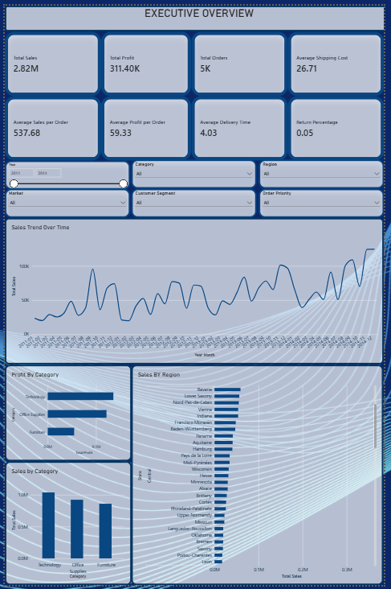
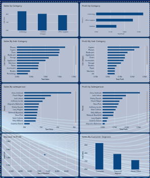

# E-Commerce Data Analysis

A comprehensive data analysis project showcasing sales trends, profitability, customer behavior, and regional performance metrics for an e-commerce business using Power BI dashboards and detailed data exploration.

## Dashboard preview





## 📊 Project Overview

This project analyzes a complete e-commerce dataset with **2.62M in total sales**, **311.40K in profit**, and **5K orders**. The analysis includes interactive Power BI dashboards, visualizations, and key business insights.

## 📈 Key Metrics

| Metric | Value |
|--------|-------|
| **Total Sales** | 2.62M |
| **Total Profit** | 311.40K |
| **Total Orders** | 5K |
| **Average Sales per Order** | 537.68 |
| **Average Profit per Order** | 59.33 |
| **Average Shipping Cost** | 26.71 |
| **Average Delivery Time** | 4.03 days |
| **Return Percentage** | 0.05% |

## 📁 Project Structure

```
ecommerce-data-analysis/
│
├── README.md                          # Project documentation
├──  ecommerce_dataset.csv          # Main dataset file
│
├── ECOMM_Dashboard
```

## 📊 Dashboard Overview

### Executive Overview Dashboard
Comprehensive overview of key business metrics and trends:
- **Sales Trend Over Time**: Line chart showing sales fluctuations with overall upward trend
- **Profit By Category**: Horizontal bar chart comparing profitability across product categories
- **Sales By Category**: Vertical bar chart showing sales volume by category
- **Sales By Region**: Horizontal bar chart displaying regional sales distribution

**Interactive Filters:**
- Date Range
- Category
- Region
- Customer Segment
- Ship Priority

### Detailed Analysis Dashboard
In-depth analysis with multiple perspectives:
- **Orders by Payment Status**: Payment method distribution
- **Sales Trend by Sub-Region**: Regional performance details
- **Sales by Sub-Category**: Granular category breakdown
- **Sales by City/Geography**: City-level performance metrics
- **Quantity by Ship Mode**: Shipping method analysis
- **Orders by Payment Category/Segment**: Customer segment insights

## 💡 Key Insights

1. **Sales Growth**: Consistent upward trend in sales over time with seasonal variations
2. **Profitability**: Strong profit margins across most categories with top performers in specific segments
3. **Regional Performance**: Varying sales performance across different regions with distinct patterns
4. **Delivery Efficiency**: Average delivery time of 4.03 days with low return rates (0.05%)
5. **Customer Value**: Average order value of 537.68 with consistent profit per order

## 🛠️ Technologies Used

- **Power BI**: For interactive dashboards and visualizations
- **CSV/Excel**: Data storage and preparation
- **Data Analysis**: Trend analysis, category analysis, regional insights

## 📥 How to Use

### Viewing Dashboards
1. Download the `.pbix` files from the `dashboards/` folder
2. Open them with **Power BI Desktop** (free download available at powerbi.microsoft.com)
3. Use the interactive filters to explore different perspectives
4. Hover over charts for detailed tooltips and insights

### Working with Data
1. The dataset is stored in `data/ecommerce_dataset.csv`
2. Import the CSV file into your preferred analytics tool
3. Refer to `documentation/Data_Dictionary.md` for column descriptions
4. Use the insights provided to inform business decisions

## 📋 Data Dictionary

**Key Columns in Dataset:**
- `Sales`: Total sales amount for each order
- `Profit`: Profit generated from each order
- `Quantity`: Number of items ordered
- `Category`: Product category
- `Sub-Category`: Specific product sub-category
- `Region`: Geographic region of the order
- `Ship Mode`: Shipping method used
- `Delivery Time`: Days taken to deliver
- `Return Rate`: Percentage of returns
- `Customer Segment`: Type of customer

## 🎯 Use Cases

- ✅ Business intelligence and reporting
- ✅ Sales performance analysis
- ✅ Regional market comparison
- ✅ Product category performance tracking
- ✅ Profitability analysis
- ✅ Customer behavior insights
- ✅ Shipping and delivery optimization

## 📧 Contact & Support

For questions or suggestions about this project, feel free to reach out or open an issue on GitHub.

## 📝 License

This project is provided as-is for educational and analytical purposes.

---

**Last Updated**: September 2026

**Author**: sejalpatil432
